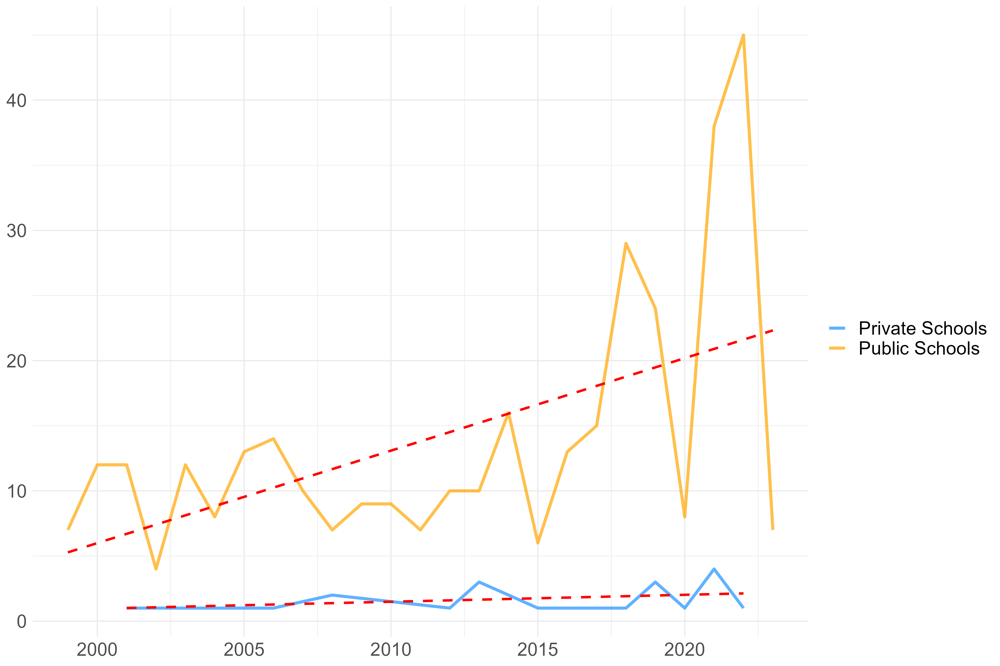

# Washington Post Data Visualization
 
This repository contains an R script that pulls in and visualizes the [dataset compiled and maintained](https://www.washingtonpost.com/education/interactive/school-shootings-database) by the Washington Post documenting school shootings in the United States.  

  

 

It asks questions like _"How often does this happen in private school settings?"_ (see above) and _"Where are these incidents occurring?"_ as depicted in the animation below. 

Of the 366 incidents in the current version of the dataset, 112 (31%) are missing the *shooter relationship* attribute. For the remaining ~70% of the incidents, a current or former student was the perpetrator with an average age of 15 years. 

----

<iframe src="https://bw6xs.github.io/cville/sales_since_2017_less_than_2M.html" width="100%" height="400" frameborder="0" scrolling="no" allowfullscreen data-external="1"></></iframe>

----
